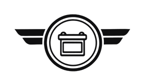
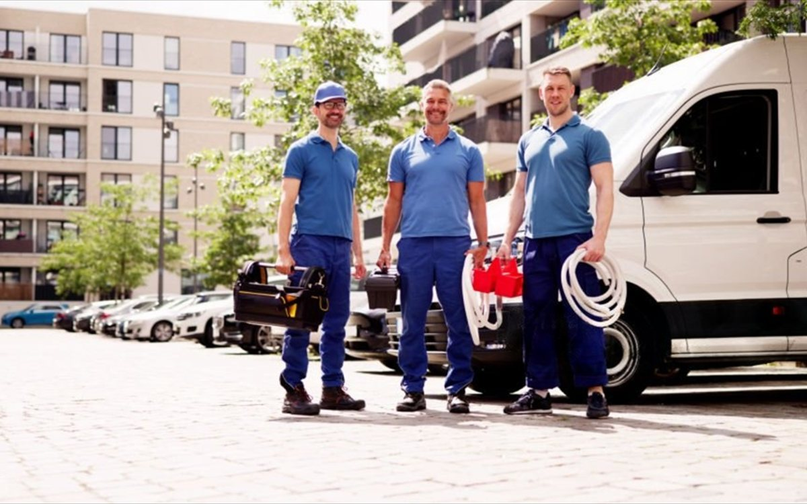

<div align="center">
  

  # CambiaTuBatería Perú

  Venta, instalación y auxilio mecánico de baterías de auto **a domicilio**
  en Lima y Callao — sin talleres, sin esperas.

  ### 🔗 [cambiatubateriaperu.com](https://cambiatubateriaperu.com)

  
  
  
  
</div>

<br />


---

## Qué es esto

El caso de uso central es de alta urgencia: alguien con el auto varado,
desde el celular, en la calle. Todo el diseño — velocidad, jerarquía visual,
un solo canal de contacto — está pensado para ese momento.

## Características

- **Catálogo real** con buscador en cascada Marca → Modelo → Año, filtrado
  en sitio sin recargar la página ni navegar a otra URL.
- **Panel de administración propio** (sesión + CSRF) desde donde el negocio
  edita precios, productos, fotos, textos de cada página y datos de contacto
  — sin tocar código ni depender de un desarrollador para cambios de
  contenido.
- **Mejora progresiva en todo lo editable:** el HTML siempre trae un valor
  por defecto correcto horneado; si la base de datos no responde, el sitio
  se ve exactamente igual, sin huecos ni texto roto.
- **PWA instalable** con Service Worker — el teléfono de contacto sigue
  disponible en modo offline, el escenario real de alguien varado sin datos
  móviles.
- **Presupuesto de rendimiento verificado por test** (FCP < 0.8s, CSS y JS
  con tope en gzip) — no es una preferencia estética: alimenta el Quality
  Score de Google Ads, así que una landing lenta se paga en dinero.
- **Auditoría de accesibilidad automatizada** con axe-core contra WCAG2 AA.

## Capturas

<table>
  <tr>
    <td width="50%"></td>
    <td width="50%"></td>
  </tr>
</table>

## Stack

| Capa | Tecnología |
|---|---|
| Frontend | HTML5 + CSS3 + JavaScript ES2022 (módulos nativos), tipado con JSDoc |
| Backend | PHP 8 + MySQL |
| Hosting | cPanel compartido, despliegue por FTP |
| Build | Ninguno — lo que está en el repositorio es lo que se sube |
| Tests | `node --test` (unitarios) + Playwright (E2E) |

Sin framework, sin paso de compilación: `npm` existe solo para correr
pruebas, nunca para generar el sitio.

## Desarrollo local

```bash
npm install
npm test              # 729 tests unitarios
npm run serve          # sitio en http://127.0.0.1:8000
npm run test:e2e       # Playwright
npm run audit:a11y     # accesibilidad, requiere npm run serve corriendo
```

Requiere PHP 8 en el PATH. Sin MySQL local, los endpoints caen a un respaldo
JSON — útil para ver la degradación, no para datos reales.

## Estructura

```
adminbateria/    panel de administración (requiere sesión)
pagbateria/      sitio público
  public/        HTML, CSS, JS — lo que sirve el navegador
  backend/api/   endpoints PHP, uno por área editable
api/             librerías compartidas entre los dos backends
tests/           unitarios + e2e
BDbateria.sql    esquema de base de datos
```

---

<div align="center">
  <sub>Sitio en producción — desarrollado a medida para el negocio real.</sub>
</div>
